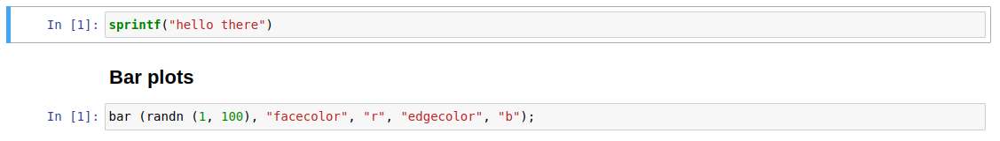
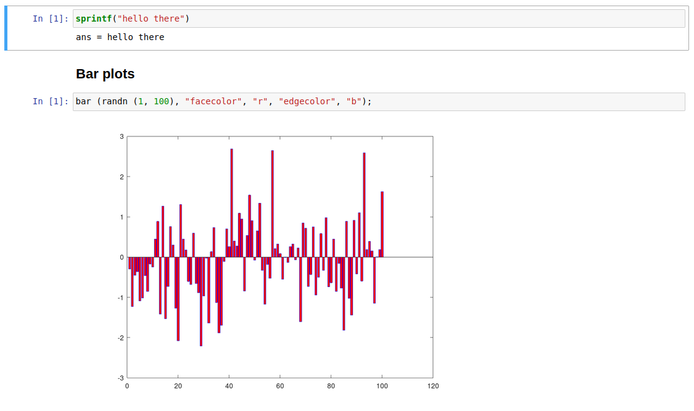
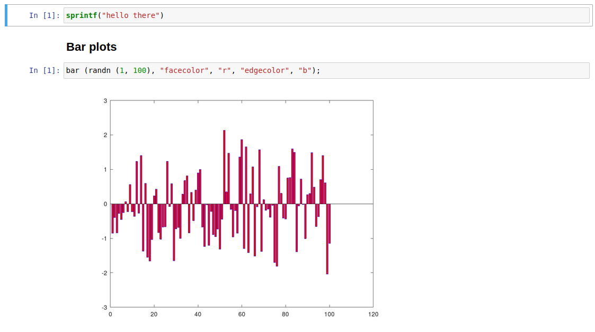
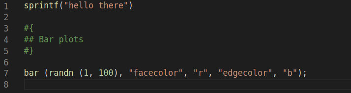

# Octave Jupyter Notebook package


A package to run and fill Jupyter Notebooks within GNU Octave.

The package supports filling both textual and graphical outputs.

## Installation
From the Octave command-line:
```
pkg install "https://github.com/gnu-octave/pkg-jupyter-notebook/archive/v1.0.0.tar.gz"
```

## JupyterNotebook
```
notebook_object = JupyterNotebook (notebookFileName)
```

This `classdef` has a public attribute `notebook` which is the `struct` that we get from decoding the JSON text that represents the notebook. This attribute is left public on purpose in case the user wants to manipulate the notebook more.

**Note:** `nbformat` versions lower than 4.0 are not supported.

## plot magic
`%plot` magic is supported with the following settings:
* `%plot -f <format>` or `%plot --format <format>`: this setting allows you to specify the format of the images generated from plotting. the supported formats are:
    * PNG (default format)
    * SVG (Note: SVG images may not appear in the notebook. To view them, trust the notebook).
    * JPG

* `%plot -r <number>` or `%plot --resolution <number>`: this setting allows you to specify the resolution of the images generated from plotting.

* `%plot -w <number>` or `%plot --width <number>`: this setting allows you to specify the width of the images generated from plotting.

* `%plot -h <number>` or `%plot --height <number>`: this setting allows you to specify the height of the images generated from plotting.

## Methods
The `classdef` supports a set of methods.

### `run (cell_index)`
Run the cell with index `cell_index` in the notebook. The results are embedded in the object. The evaluation of the code inside the notebook cells is done in a separate context. This context is loaded before running the code inside the cell and saved after running it.

If the code produces figures, those figures are set hidden, saved in a temporary directory `__octave_jupyter_temp__` and removed after being embedded. The temporary directory is also removed after running the code. Your open figures won't be affected by the figures produced by the code in the notebook.

### `runAll ()`
Run all cells in the notebook. The results are embedded in the object. The evaluation of the code inside the notebook cells is done in a separate context. This context is loaded before running the code inside the cell and saved after running it.

If the code produces figures, those figures are set hidden,saved in a temporary directory `__octave_jupyter_temp__`, and removed after being embedded. The temporary directory is also removed after running the code.

Your open figures won't be affected by the figures produced by the code in the notebook.

### `generateNotebook (notebookFileName)`
Write the jupyter notebook stored in the `notebook` attribute to `notebookFileName`.

The `notebook` attribute is encoded to JSON text.

### `generateOctaveScript (scriptFileName)`
Write an Octave script that has the contents of the jupyter notebook stored in the `notebook` attribute to `scriptFileName`.

Non code cells are generated as block comments.

## Examples:
The outputs of the following examples are shown using this notebook:


### Run all cells and generate the filled notebook

```
## Instantiate an object from the notebook file
notebook = JupyterNotebook("myNotebook.ipynb")
=> notebook =

    <object JupyterNotebook>

## Run the code and embed the results in the notebook attribute
notebook.runAll()

## Generate the new notebook by overwriting the original notebook
notebook.generateNotebook("myNotebook.ipynb")
```

This is the generated notebook:


### Run the third cell and generate the filled notebook

```
## Instantiate an object from the notebook file
notebook = JupyterNotebook("myNotebook.ipynb")
=> notebook =

    <object JupyterNotebook>

## Run the code and embed the results in the notebook attribute
notebook.run(3)

## Generate the new notebook in a new file
notebook.generateNotebook("myNewNotebook.ipynb")
```

This is the generated notebook:


### Generate an Octave script from a notebook

```
## Instantiate an object from the notebook file
notebook = JupyterNotebook("myNotebook.ipynb")
=> notebook =

    <object JupyterNotebook>

## Generate the octave script
notebook.generateOctaveScript("myScript.m")
```

This is the generated script:

